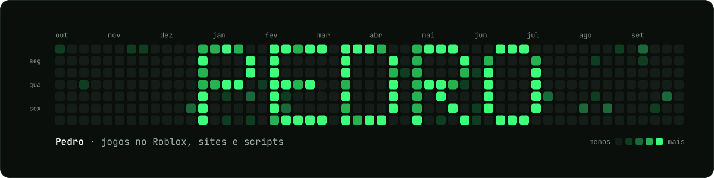
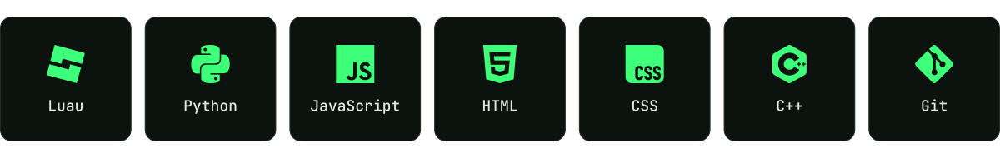
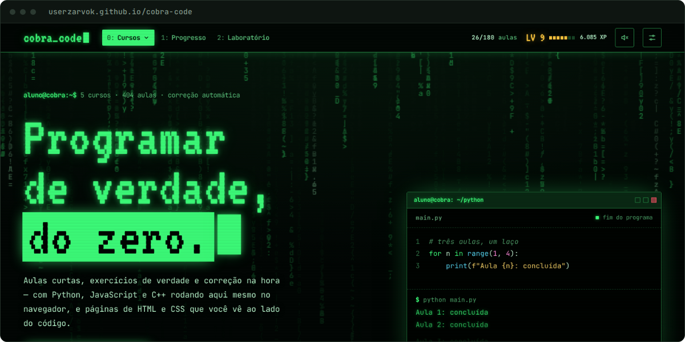
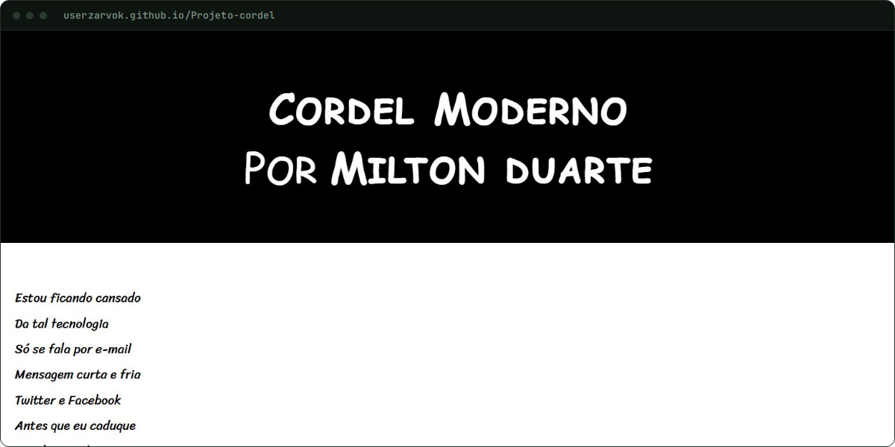

## Sobre

Faço jogos no Roblox com Luau e sites com HTML, CSS e JavaScript. Também escrevo scripts em Python e estou aprendendo C++.

## Tecnologias

## Projetos

<table>
  <tr>
    <td width="50%" valign="top">
      
      <h3>Cobra Code</h3>
      
Curso de programação que roda no navegador, com aulas de Python, JavaScript, C++, HTML e CSS e correção automática.

      
<a href="https://userzarvok.github.io/cobra-code/">Abrir o site</a> · <a href="https://github.com/Userzarvok/cobra-code">Código</a>

    </td>
    <td width="50%" valign="top">
      
      <h3>Cordel Moderno</h3>
      
O poema de Milton Duarte numa página feita com HTML e CSS.

      
<a href="https://userzarvok.github.io/Projeto-cordel/">Abrir o site</a> · <a href="https://github.com/Userzarvok/Projeto-cordel">Código</a>

    </td>
  </tr>
</table>
