## `$ whoami`

Sou o **Pedro**, desenvolvedor em formação. Aprendo programando de verdade: faço sites com HTML e CSS, escrevo lógica
em Python e JavaScript, crio no Roblox Studio com Luau e agora estou entrando no C++. Gosto de projetos que dá para
abrir e usar na hora.

## `$ cat stack.txt`

  
  
  
  
  
  
  
  

## `$ ls ~/projetos`

<table>
  <tr>
    <td colspan="2">
      
      <h3>Cobra Code</h3>
      Curso de programação completo que roda no navegador: <b>5 cursos e 404 aulas</b> de Python, JavaScript, C++,
      HTML e CSS, com correção automática, XP, níveis e visual de terminal.  
      <a href="https://userzarvok.github.io/cobra-code/"><b>▸ abrir o Cobra Code</b></a> &nbsp;·&nbsp;
      <a href="https://github.com/Userzarvok/cobra-code">▸ repositório</a>
    </td>
  </tr>
  <tr>
    <td width="50%" valign="top">
      
      <h4>Curiosidades de Tecnologia</h4>
      A história do mascote do Android, com HTML semântico e layout responsivo.  
      <a href="https://userzarvok.github.io/Projeto-android/">▸ site</a> &nbsp;·&nbsp;
      <a href="https://github.com/Userzarvok/Projeto-android">▸ repositório</a>
    </td>
    <td width="50%" valign="top">
      
      <h4>Cordel Moderno</h4>
      O poema de Milton Duarte no clima da literatura de cordel, com fundos fixos e Google Fonts.  
      <a href="https://userzarvok.github.io/Projeto-cordel/">▸ site</a> &nbsp;·&nbsp;
      <a href="https://github.com/Userzarvok/Projeto-cordel">▸ repositório</a>
    </td>
  </tr>
  <tr>
    <td width="50%" valign="top">
      <h4>html-css</h4>
      26 exercícios de HTML5 e CSS3, do primeiro parágrafo às tabelas, cada um publicado para abrir no navegador.  
      <a href="https://userzarvok.github.io/html-css/">▸ exercícios</a> &nbsp;·&nbsp;
      <a href="https://github.com/Userzarvok/html-css">▸ repositório</a>
    </td>
    <td width="50%" valign="top">
      <h4>java-script</h4>
      Meus exercícios de JavaScript, um por arquivo, conforme avanço na linguagem.  
      <a href="https://github.com/Userzarvok/java-script">▸ repositório</a>
    </td>
  </tr>
</table>

## `$ cat agora.txt`

- construindo o **Cobra Code**, meu curso de programação que roda no navegador;
- estudando **Python** do zero ao avançado e dando os primeiros passos em **C++**;
- criando no **Roblox Studio** com Luau.

<code>pedro@github:~$ exit</code>

